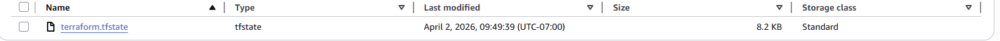
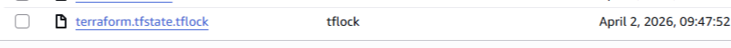

# Terraform S3 Backend Lab

## Setup
Cloned the starter repository and familiarized myself with the scripts and Terraform configuration.

Created an S3 bucket using the provided script:
```
./create-bucket sami-terraform-backend-bucket-2026
```

## Questions

### When is the state file created?
The state file is created in the S3 bucket after `terraform apply` completes successfully.

### When is the lock file present?
The lock file is present during the execution of `terraform apply`. From the moment the command runs until it completes. To see it, refresh the S3 console after running `terraform apply` but before typing `yes`.

### Is the lock file always in the bucket after it is created?
No. The lock file is temporary. Terraform automatically removes it from the S3 bucket once the operation completes. It only persists if a Terraform run is interrupted or crashes.

## Screenshots

### State file only


### Lock file and state file
