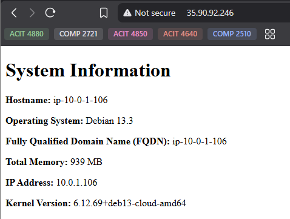

# Intro to Ansible Lab

## SSH Key Setup

Create a new SSH key pair named `aws`:
```bash
ssh-keygen -t ed25519 -f ~/.ssh/aws
```

Import the Public Key to AWS
```bash 
chmod +x import_lab_key
./import_lab_key ~/.ssh/aws.pub
```

Delete Key at the end when done with everything 
```bash 
chmod +x delete_lab_key
./delete_lab_key
```

## Terraform

Go to terraform/ directory then run the following: 
```bash 
terraform init
terraform fmt
terraform validate
terraform plan
terraform apply
```

At the end of lab, don''t forget to use destroy
```bash 
terraform destroy
```

## Ansible (Configuring the EC2 instances)

Go to ansible/ directory then run the following:

Check the playbook syntax 
```bash
ansible-playbook --syntax-check playbook.yml
```

Test connectivity to managed nodes 
```bash 
ansible all -m ansible.builtin.ping
```

Run the playbook
```bash
ansible-playbook playbook.yml
```

## Webpage 

