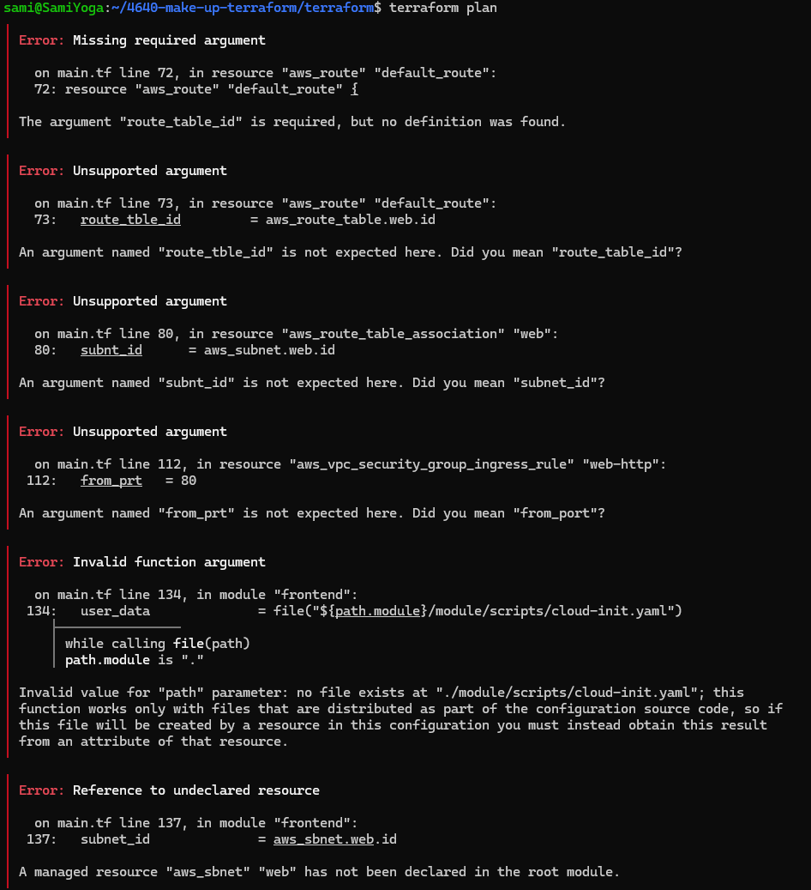
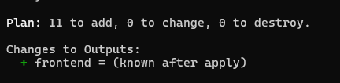
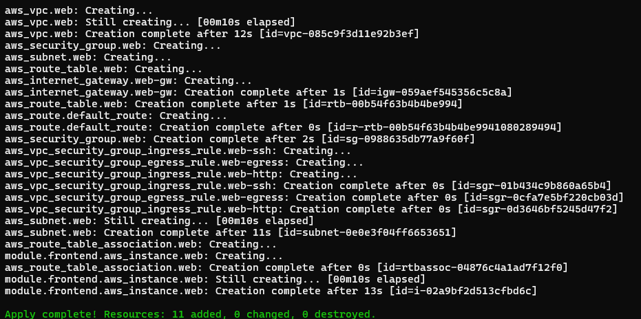

# 4640 Make Up Lab

## Initial Setup 

- Copy git repo 
- cd into it 
- examine file structure and cat files

## terraform plan errors

Ran `terraform plan` and got 6 errors right away:

## what I fixed

**Error 1 & 2: `route_tble_id` (line 73)**
These two errors are actually the same problem. `route_tble_id` is a typo, should be `route_table_id`. Because terraform didn't recognize the misspelled argument, it also complained that the required `route_table_id` was missing. 

**Error 3:  `subnt_id` (line 80)**
`subnt_id` should be `subnet_id` in the route table association block.

**Error 4:  `from_prt` (line 112)**
`from_prt` should be `from_port` in the http ingress rule.

**Error 5: wrong file path (line 134)**
The path to cloud-init.yaml said `module/scripts/cloud-init.yaml` but the folder is just `scripts/`, not `module/scripts/`. 

**Error 6: `aws_sbnet` (line 137)**
`aws_sbnet.web.id` is a typo, should be `aws_subnet.web.id`.

## working plan and apply

After fixes, `terraform plan` worked:

And `terraform apply` created everything fine:

